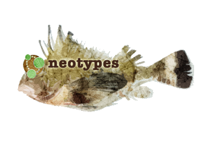

> neotype - a type specimen that is selected subsequent to the description of a species to replace a preexisting type that has been lost or destroyed.

# neotypes

:warning: The library is under heavy development. Production use is at your own risk and is not recommended. :warning:

For early adopters:

|Supports Scala 2.12 and 2.13||
| ----------------------------------------- |:--------------|
|`"com.dimafeng" %% "neotypes" % version`|core functionality. Supports `scala.concurrent.Future`.|
|`"com.dimafeng" %% "neotypes-cats-effect" % version`|`cats.effect.Async[F]` implementation.|
|`"com.dimafeng" %% "neotypes-monix" % version`|`monix.eval.Task` implementation.|
|`"com.dimafeng" %% "neotypes-zio" % version`|`zio.Task` implementation.|
|`"com.dimafeng" %% "neotypes-akka-stream" % version`|result streaming for Akka Streams.|
|`"com.dimafeng" %% "neotypes-fs2-stream" % version`|result streaming for FS2.|
|`"com.dimafeng" %% "neotypes-monix-stream" % version`|result streaming for Monix Observables.|
|`"com.dimafeng" %% "neotypes-zio-stream" % version`|result streaming for ZIO ZStreams.|
|`"com.dimafeng" %% "neotypes-refined" % version`|support to insert and retrieve refined values.|
|`"com.dimafeng" %% "neotypes-cats-data" % version`|support to insert and retrieve `cats.data` values.|
|`"com.dimafeng" %% "neotypes-enumeratum" % version`|support to insert and retrieve Enumeratum enums.|

**Scala lightweight, type-safe, asynchronous driver (not opinionated on side-effect implementation) for neo4j**.

* **Scala** - the driver provides you with support for all standard Scala types without the need to convert Scala <-> Java types back and forth and you can easily add your types.
* **Lightweight** - the driver depends on `shapeless` and `neo4j Java driver`.
* **Type-safe** - the driver leverages [typeclasses](https://blog.scalac.io/2017/04/19/typeclasses-in-scala.html) to derive all needed conversions at the compile time.
* **Asynchronous** - the driver sits on top of [asynchronous Java driver](https://neo4j.com/blog/beta-release-java-driver-async-api-neo4j/).
* **Not opinionated on side-effect implementation** - you can use it with any implementation of side-effects of your chose (scala.Future, cats-effect
 IO, Monix Task, etc) by implementing a simple typeclass. `scala.Future` is implemented and comes out of the box.

The project aims to provide seamless integration with most popular scala infrastructures such as lightbend (Akka, Akka-http, Lagom, etc), typelevel (cats, http4s, etc), twitter (finch, etc)...

## Resources

* [Documentation](https://neotypes.github.io/neotypes)
* [Example project (Akka-http + neotypes)](https://github.com/neotypes/examples)

## Code of Conduct

We are committed to providing a friendly, safe and welcoming environment for all, regardless of level of experience, gender, gender identity and expression, sexual orientation, disability, personal appearance, body size, race, ethnicity, age, religion, nationality, or other such characteristics.

Everyone is expected to follow the [Scala Code of Conduct](https://www.scala-lang.org/conduct/) when discussing the project on the available communication channels.

## Special thanks

* [Luis Miguel Mejía Suárez](https://github.com/BalmungSan)
* [geoffjohn11](https://github.com/geoffjohn11)
